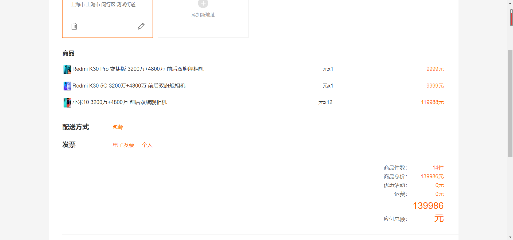

# python django仿小米商城后端服务
## 介绍

模拟小米官网的后端服务

项目运行环境

| nodejs       | 10.9.0+  |
|--------------|--------|
| egg       | 2.10.0 |
| jsonwebtoken   | 9.0.2 |
| mysql        | 5.7+   |


## 后端运行先配置数据库（mysql 和redis）

[代码地址Gitee](https://gitee.com/gitxys/mi_express_nodejs)

[代码地址GitHub](https://github.com/xuyisu/mi_express_nodejs)

数据库连接需改

```
config.sequelize = {
    dialect: 'mysql', // support: mysql, mariadb, postgres, mssql
    database: 'mi_mall',
    host: '127.0.0.1',
    port: 3306,
    username: 'root',
    password: '123456',
    timezone: '+08:00',
      define: {
        timestamps: false, // add createAt and updateAt timestamp fields
        underscored: true, // use camelCase for model, but snake_case for database
      }
  };
```


## 后端启动
安装依赖包
```
npm install
```
启动服务
```
npm run dev
```

## 其他语言后端地址

| 名称                       | Gitee                                      | Github                                      |
| -------------------------- | ------------------------------------------ | ------------------------------------------- |
| mi_springboot (Java)       | https://gitee.com/gitxys/mi_springboot     | https://github.com/xuyisu/mi_springboot     |
| mi-beego (Golang)          | https://gitee.com/gitxys/mi-beego          | https://github.com/xuyisu/mi-beego          |
| mi-gin (Golang)            | https://gitee.com/gitxys/mi-gin            | https://github.com/xuyisu/mi-gin            |
| mi_django (Python)         | https://gitee.com/gitxys/mi_django         | https://github.com/xuyisu/mi_django         |
| mi_fastapi (Python)        | https://gitee.com/gitxys/mi_fastapi        | https://github.com/xuyisu/mi_fastapi        |
| mi_koa_nodejs (nodejs)     | https://gitee.com/gitxys/mi_koa_nodejs     | https://github.com/xuyisu/mi_koa_nodejs     |
| mi_express_nodejs (nodejs) | https://gitee.com/gitxys/mi_express_nodejs | https://github.com/xuyisu/mi_express_nodejs |
| mi_egg_nodejs (nodejs)     | https://gitee.com/gitxys/mi_egg_nodejs     | https://github.com/xuyisu/mi_egg_nodejs     |
|                            |                                            |                                             |


## 前端启动

项目地址https://gitee.com/gitxys/mi_vue

[代码地址Gitee](https://gitee.com/gitxys/mi_vue)

[代码地址GitHub](https://github.com/xuyisu/mi_vue)

控制台先安装依赖包

```
npm install 
```

然后运行下面代码即可启动

```
npm run serve
```

## 页面介绍

浏览器输入http://localhost:8080 将看到一下页面


登录:**用户名/密码**  admin/123456


购物车


订单确认



订单结算(彩蛋！！！！   这里的结算做了特殊处理)


订单列表


亲，留个star 吧
